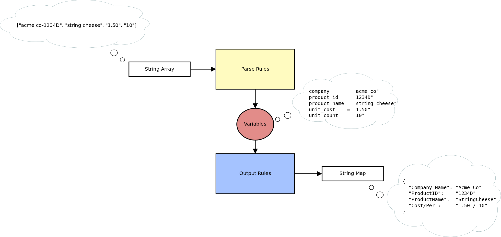

# CsvTransformer
CsvTransformer is a tool for transforming CSV records into new records.
As it's input it takes a script written in a custom DSL, and outputs 
records built by transforming the input data.

Here is an example of what a transform script looks like.

```txt
# Simple example script
Parse:
    0 AS var_a
    1 AS /^(?<var_b>\d+)-(?<var_c>\d+)$/
Output:
    str Field 1: var_a + " thing" | REPLACE "-" "_" | TITLE_CASE
    int Field 2: var_b
   date Field 3: var_b + "/" + var_c + "/2020"
```

For more information checkout the output of --help.

(Here are a few diagrams to augment the help text)
## DSL Overview

- Scripts act on records which are arrays of strings
- The parse block extracts a set of string variables
- The Output rules use the extracted variables and pass them through chains of transfroms
- The tranform chains produce a key-value map
- This key value map is then written out to stdout by the JSON or CSV writter.

## Structure of an Output Rule

- Output rules start with the cast (yellow) which is the final type to appear in the output map.
  Depending on the output type, the cast may be reflected in the final output.
- The name (blue) is the key string in the output map.  For CSV output, the name currently isn't used.
- The first element in an output chain (red) must be a value (i.e. a variable or string literal)
- The rest of the chain consists of transforms (green) seperated by "|" characters.  
  These transforms may take arguments which can be strings or variables.  Transforms are evaluated
  from left to right.

## Goals
My goals in writing this project were:
1. Create an expressive and intuitive language to describe a wide variety of transformations.
2. Make it very easy to extend this language.
3. Make the API for the application intuitive
4. Write lovely code.
5. Unit test the important bits you have time for.
6. Avoid relying on any meaningful external dependencies.
7. Have fun.

## Design choices
1. I decided to create a DSL for 3 reasons:
   1. Goal 7 is to have fun, and I've always wanted to write one.
   2. While using JSON/XML/YAML/etc. would have saved me writing 
      an admittedly quick-and-dirty lexer, the resulting 
      DSL-built-on-DSL would likely be cumbersome to use.
   3. Since there is a regex parse-type, the DSL is flexible enough
      to handle most real-world use cases I could imagine.
2. Due to the use of the GoF Decorator pattern, adding new 
   Transforms is as simple as creating a small sub-class and adding
   1 line to main.php to register it.  For a good example, look at any
   of the files under src/Transfrom/Decorator.  Adding new cast types
   is similarly simple.
3. This is a CLI application, which is pretty well documented,
   so the API is intuitive.  Also, since it is designed to return
   meaningful status codes to the shell, and it writes to stdout,
   it's easy to incorporate this into a shell script so it can
   itself be a part of a concurrent processing chain. 
4. Other than the entry point (main.php) and the QuickAndDirtyParser 
   class, this code is readable and reasonably well factored and 
   documented.
5. I tested some core-parts.  I'd like to write more tests, but I had
   to "stop adding paint" at some point, and I wanted to be able to 
   honestly say I hadn't spent more than 20-25 hours on this project.
6. I wrote all of the code used here.  If I weren't constrained
   by this goal, I likely would have used a library for lexing and 
   parsing, as I feel QuickAndDirtyParser is a bit cumbersome and may
   be hiding some tricky to find bugs.
7. I got carried away and had a blast.  Even if the people reading this
   aren't impressed, I had a blast, and honestly had trouble putting it
   down.  I'll probably pick it up again at some point in the future.

## Assumptions/simplifications
1. Though it wouldn't be hard to add, I didn't create a way to use the
   first CSV record to define column names.  Parse rules have to 
   reference columns by index.

## Running the thing
All commands should be run from the root directory of the project.  When you first download/clone the project, you will have to run composer install to pull in the dependancies (just the unit testing framework) and build the classmap/autoloader.

### Run composer install
```shell
php composer.phar install
```

### Run project
```shell
php main.php examples/test_config.txt examples/test.csv
```

### View documentation
```
php main.php --help
```

### Run unit tests
```
php vendor/phpunit/phpunit/phpunit --no-configuration test --testdox
```

### Docker
To run the project with Docker, prefix the above commands with something like the following:
```
docker run -v "$(pwd):/app" -w /app php:8.1-cli
```

## Future enhancements
If I find the time I would love to:
1. Tidy up main.php, probably using a library to improve the CLI API code.
2. Implement more casts and transforms.
3. Write more unit tests.
4. Add a way to group transforms with parens or something.
   I think that would make the output rule syntax more complete.
   Currently, there's no clean way to, for example, pass 2 variables
   concatenated together as an argument to a transform.
5. Package the whole thing as a PHAR so it's easier to install and run.
6. Add a new block called something like "Options" to add settings like:
   - Skip first line
   - Parse header column names
   - Timezone for time stamps
7. Add a property to Transforms and Casts that holds a description of what 
   they do.  This could be added to the output of --list-transforms and --list-casts
